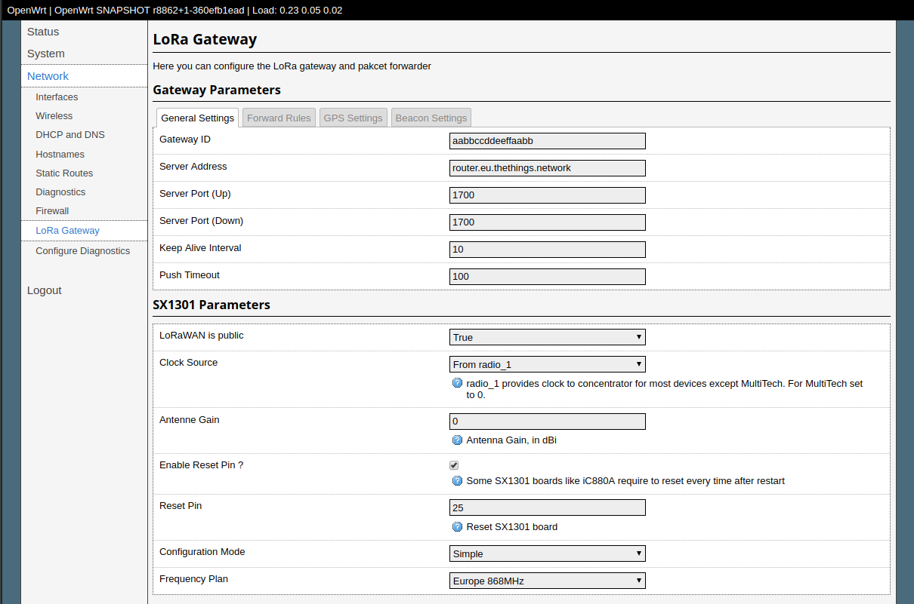

# lora-feed
Semtech and LoRaServer packages for OpenWRT.

## Table of Contents

- [ToDo](#todo)
- [Prerequisites](#prerequisites)
- [Attention](#attention)
- [Install](#install)
- [Contribute](#contribute)
- [License](#license)
- [Donation](#donation)

## ToDo
- [ ] chirpstack server test
- [ ] chirpstack toml configuration files
- [ ] chirpstack toml configuration generation
- [ ] chirpstack toml configuration with UCI
- [x] lorawan-stack build for front-end
- [ ] lorawan-stack LuCI interface

## Prerequisites

In addition to packages required by [OpenWRT](https://openwrt.org/docs/guide-developer/build-system/install-buildsystem), 
extra packages should be installed if you want to install the LoRaServer:

    sudo apt install go-bindata
    sudo apt install nodejs
    sudo apt install npm

## Attention
If you want to compile `basicstation` with OpenWRT Version > 18.06, you need to uninstall the `lora-gateway-hal` 
and install the same one from this feed. Because the official package has no patch for `basicstaion`.

    $ ./scripts/feeds uninstall lora-gateway-hal
    $ ./scripts/feeds install -p lora lora-gateway-hal

## Install

Edit your feeds.conf or feed.conf.default and add the following to it:

    # Semtech
    src-git lora https://github.com/xueliu/lora-feed

Update your build environment and install the packages:

    $ ./scripts/feeds update lora
    $ ./scripts/feeds install -a -p lora
    $ make menuconfig

Most programs are located in `Network -> LoRaWAN`

Exit, save and build

    $ make -j4

## Contribute

Found a bug? Please create an issue on GitHub:
    https://github.com/xueliu/lora-feed/issues

Further tests and PR's are welcome and appreciated.

## Donation

In order to fully test of functions, donations of LoRa gateway boards with GPS and Pico gateways are appreciated

## License

GPLv2
